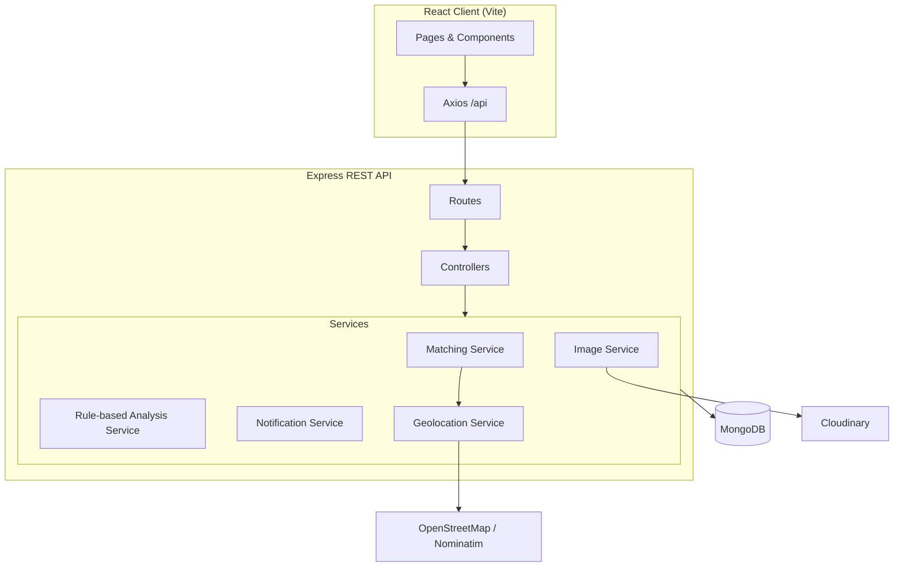

# LostLens Architecture

## Principles

1. Thin controllers — HTTP only; business logic in services.
2. Matching-first — `matchingService` is the core differentiator.
3. Rule-based — Simple, transparent matching algorithm (no AI/ML).
4. Graceful degradation — no email/Cloudinary keys required for local demo.
5. Security — Helmet, CORS, rate limits, JWT httpOnly cookies, server-side role checks.
